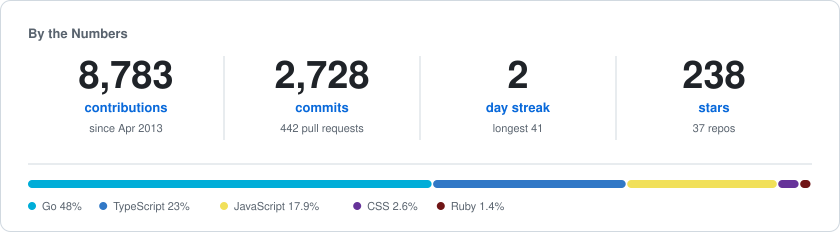

<h1 align="center">Danilo Alonso</h1>

  Software engineer, 15+ years. 
  The tools change but the problems don't.

  
  

---

## About

I've been building software for over 15 years. I started in the full-stack grind (PHP, Rails, jQuery, that whole era) and over time moved toward the *why* behind things instead of the *how*. That shift made me a better engineer than any framework ever did. These days I think about architecture, boundaries, and the fundamentals that don't expire.

## Tech I reach for

  
  
  
  
  
  
  
  
  
  
  
  

## Open Source

Flagships:

- **[noormdev/noorm](https://github.com/noormdev/noorm):** A database manager TUI for people who actually like SQL. Postgres, MSSQL, MySQL, SQLite, with a TypeScript SDK in the box. · [noorm.dev](https://noorm.dev)
- **[noormdev/ignatius](https://github.com/noormdev/ignatius):** Data modeling as code. Author entities, data flow diagrams, and models as files, then verify them with the `ignatius` CLI.
- **[hapi](https://hapi.dev) / [hapipal](https://hapipal.com):** Member of the hapi Technical Steering Committee (TSC). A server framework that doesn't change every six months.
- **[logosdx/monorepo](https://github.com/logosdx/monorepo):** TypeScript utilities I got tired of rewriting. Resiliency, observability, flow control, queues. I use it in everything, from ETLs to APIs to frontends. · [logosdx.dev](https://logosdx.dev)

## For the Vibes

- **[atomic-claude](https://github.com/damusix/atomic-claude):** My Claude Code workflow, turned into a system. TDD loops, project signals, structured commits, spec-driven subagents. Fewer tokens, faster decisions. · [atomic.alonso.network](https://atomic.alonso.network)
- **[skills](https://github.com/damusix/skills):** AI skills that pay the bills. Deep, well-curated coverage for the common (MSSQL, Postgres, hapi) and the uncommon (HTMX, Hurl, CLIs). Works with Claude Code, Cursor, OpenCode, and friends.
- **[ghost-mcp](https://github.com/damusix/ghost-mcp):** MCP server for Ghost CMS. Manage content, members, and newsletters through an LLM.
- **[buffer-mcp](https://github.com/damusix/buffer-mcp):** MCP server for the Buffer social API. Posts, channels, organizations, and ideas from any MCP-compatible client.

## By the Numbers

  <picture>
    <source media="(prefers-color-scheme: dark)" srcset="assets/stats-dark.svg">
    <source media="(prefers-color-scheme: light)" srcset="assets/stats-light.svg">
    
  </picture>

